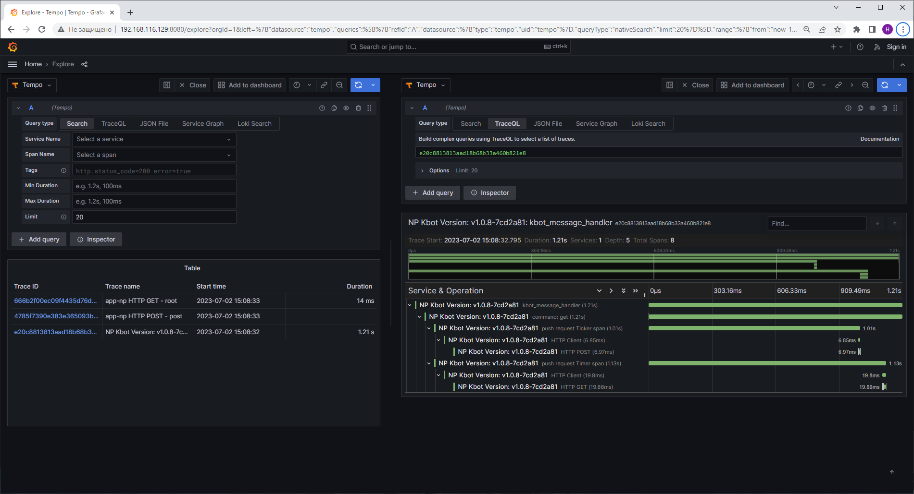

# kbot
DevOps application from scratch / DevOps застосунок з нуля
## Телеграм бот
Телеграм бот написано мовою Golang з метою ознайомлення з основними поняттями та функціями мови програмування.

Посилання на бота:  https://t.me/NickP_study_bot

### v1.0.8
Додано:

- опрацювання та відправка трейсів, згенерованих в залежності від вхідних команд користувача. Сервер метрик визначається змінною оточення TRACES_HOST.

- команда /get <message>: з де-якою затримкою робить 2 запити GET та PUSH на зовнішній http-сервер. Адреса сервера визначається змінною оточення APP_URL.

> В якості демонстрації зовнішнім сервером було обрано Grafana TNS App. Приклад ілюстрації збереженого трейсу на сервері метрик після виконання команди /get телеграм ботом дивись на [мал.1.1](README.md#приклад-роботи-команди-get-)
>

### v1.0.7
Додано:

- стандартизований Logger (github.com/hirosassa/zerodriver).

- опрацювання та відправка метрик, згенерованих в залежності від вхідних команд користувача. Сервер метрик визначається змінною оточення METRICS_HOST.

### v1.0.6
Додано:

- автоматичний запуск Action Workflow при push до репозиторію у гілку main.

- Jenkins pipeline на мові groovy для білду артефакту за допомогою Jenkins.

Виправлення та доопрацювання файлів Makefile та Dockerfile.

### v1.0.5
Додано:

- створення Helm Chart для розгортання на Kubernetes кластер.

- автоматичний запуск Action Workflow при push до репозиторію у гілку develop.

### v1.0.4
Додано команди:

/start - запуск бота та отримання первісної інструкції

/start hello, /hello або hello - привітання та вивід поточної версії бота

/help - допомога з використання бота

ping - Pong

#### Приклад роботи команди /get <message>

