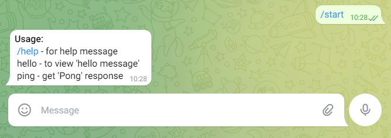

# Цикл розгортання засосунку Kbot у кластері за допомогою Helm-Chart'у

## Створення Helm-пакету на базі репозиторію застосунку kbot

1.1 Запустимо репозиторій з застосунком kbot (<https://github.com/NickP007/kbot>) на GitHub у Codespace.

1.2 Перевіримо наявність helm-клієнту командою:

```bash
 helm version
```

> version.BuildInfo{Version:"v3.11.3", GitCommit:"323249351482b3bbfc9f5004f65d400aa70f9ae7", GitTreeState:"clean", GoVersion:"go1.20.3"}

1.3 Створимо новий Chart:

```bash
 helm create helm
```

1.4 В корньовій директорії проєкту буде створено папку 'helm', що містить темплейти файлів налаштувань згідно структури helm-проєкту.

1.5 Відредагуємо відповідні файли, додавши налаштування і відомості про застосунок, з яким ми працюємо.

1.6 Перевіримо конфігурацію на наявність можливих проблем:

```bash
 helm lint ./helm
```

1.7 Після усуненя всіх проблем та зауважень, згенеруємо результуючий yaml-файл командою:

```bash
 helm template kbot ./helm
```

1.8 Створимо Helm-репозиторій безпосереднь у GitHub:

```bash
 helm package helm/ -d docs/
 helm repo index docs/ --url https://Nickp007.github.io/kbot/
```

## Публікація Helm-репозиторію

Для публікації створеного Helm-репозиторію скористаємося `GitHub Pages`. Для цього зайдемо в налаштування GitHub-репозиторію застосунку Kbot (Settings), перейдемо до налаштувань 'Pages', у полі 'Source' виберемо 'Deploy from barnch', а в полі 'Branch' зазначимо: `branch: main,  directory: docs`. Збережемо налаштування за допомогою 'Save'.

## Інсталяція helm

3.1 Встановимо 'helm' на локальну машину, де працює kubernetes кластер, за допомогою команди:

```bash
 curl https://raw.githubusercontent.com/helm/helm/main/scripts/get-helm-3 | bash
```

3.2 Перевіримо наявність установленого клієнту:

```bash
 helm version
```

> version.BuildInfo{Version:"v3.11.3", GitCommit:"323249351482b3bbfc9f5004f65d400aa70f9ae7", GitTreeState:"clean", GoVersion:"go1.20.3"}

3.3 Добавимо створений репозиторій в Helm та оновимо список доступних чартів:

```bash
 helm repo add kbot https://Nickp007.github.io/kbot/
 helm repo update
```

> "kbot" has been added to your repositories
>
> ...Successfully got an update from the "kbot" chart repository
>
> ...Successfully got an update from the "argo" chart repository
>
> Update Complete. ⎈Happy Helming!⎈

3.4 Виведемо список встановлених Chart'ів:

```bash
helm search repo
```

## Розгортання (Deploy) застосунку Kbot за допомогою Helm

4.1 Створимо Namespace та встановимо його як поточний:

```bash
 kubectl create namespace kbot
 kubectl config set-context --current --namespace=kbot
```

З виходом чарту kbot-0.1.2 п4.2 виконувати не потрібно

> 4.2 Попередньо створимо об'єкт Secret з назвою kbot, де для змінної 'token' використаємо змінну середовища `$TELE_TOKEN`:
>
>```bash
> read -s TELE_TOKEN
> kubectl create secret generic kbot --from-literal=token=$TELE_TOKEN
>```

4.3 Встановимо Чарт 'kbot':

```bash
 helm install kbot kbot/kbot
```

4.4 Перевіримо роботу застосунку, відкривши в Telegram чат-бот @NickP_study_bot та виконавши команду `/start`:


